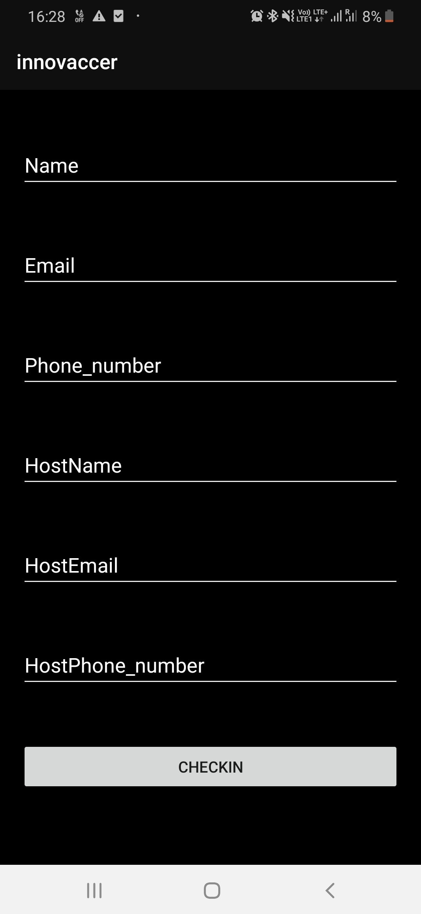
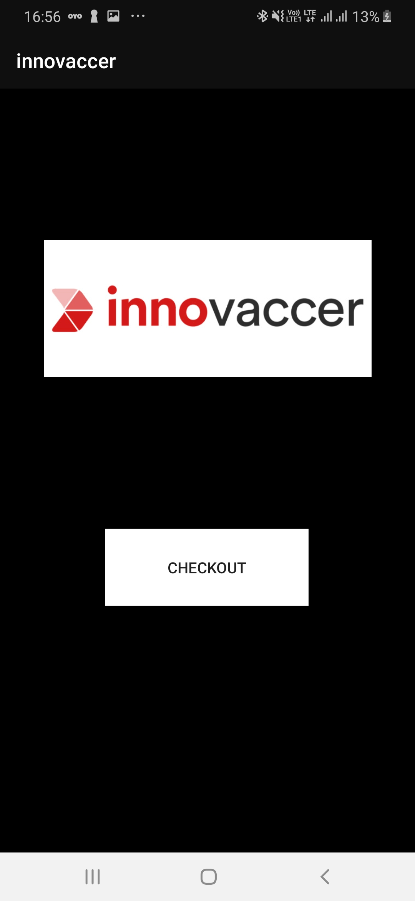

# **Entry Management App**

## The Goal :

An Android Application for collecting the information of visitor and host so that there is a record of every visitor in Office.This App will be used in various cases . For Example - An appointment app which will be used by doctors also for track the record of appointment.This Application will send message to host when user checksIn and when user checksout the user will get complete information of appointment including checkIn and checkOuttime.

### work flow of App

1) User click On App icon
2) Splash Screen will open
3) Visitor will enter information as Given below

4) when user click on checkIn button , this will send request to the server(https://github.com/peruljain/management_app_server) and following information will send to the Host.

**Information to Host**
1) Name

2) Email

3) Phone

4) CheckIn-Time

5)CheckOut-Time

All above information will be saved in django server(Sqlite Database).

5) After Clicking on check-In user will get this Screen.

Important Corner Case

a) Until User will not checkout till that time the above screen will be there.
b) If user will close the app and again open the app then same screen as shown above will open until user checksout.

How I achive this?
By Using SharedPreference method in Android (It can be done by Django rest Api).

6) When user click on checkout , the following information mail to the user email-id with the help of smtp(https://github.com/peruljain/management_app_server).

   1. Name

   2. Hostname

   3. Phone

   4. CheckIn-Time

   5. CheckOut-Time

   6. Address visited

